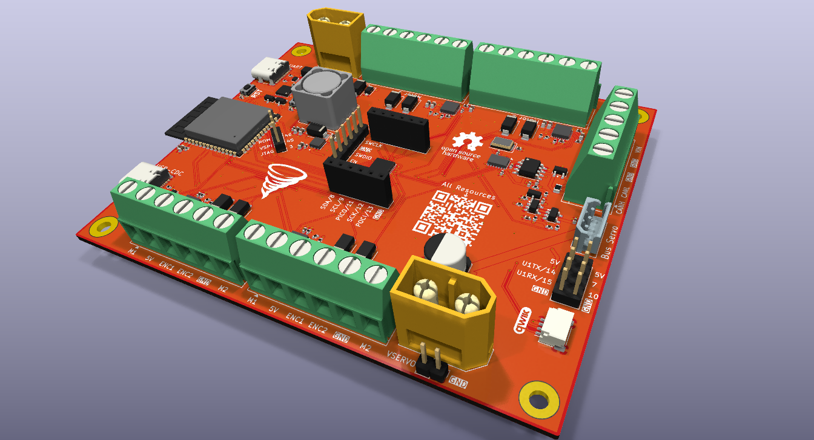
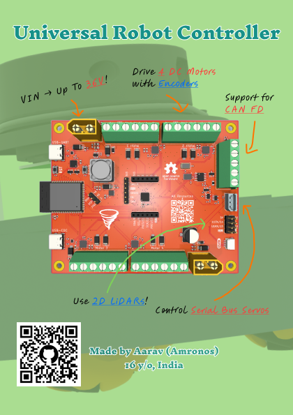

# Universal Robot Controller (URC)

## Graphics

## Features

This is what the board can do:

- Can precisely control up to <ins>**4 Brushed DC Motors**</ins> with or without quadrature <ins>**encoders**</ins>.
- Can precisely control <ins>**Serial Bus Servos**</ins> from Feetech, Waveshare, etc.
- Communicate with and control a variety of <ins>**2D LiDARs**</ins>.
- Communicate with and control other robotics hardware through <ins>**CAN FD**</ins>.
- Supports voltages up to <ins>**36V**</ins>.
- Incredible support for <ins>**ROS 2**</ins>.

The board has two microcontrollers:

1. An [ESP32-S3 module](https://documentation.espressif.com/esp32-s3_datasheet_en.pdf), specifically the [ESP32-S3-WROOM-1-N16R8](https://documentation.espressif.com/esp32-s3-wroom-1_wroom-1u_datasheet_en.pdf), which comes with 16 MB flash and 8 MB PSRAM.
2. An [STM32G431KBU6](https://www.st.com/en/microcontrollers-microprocessors/stm32g431kb.html) being used specifically for motor control.

## Why?

There are no robot control boards out there that allow one to make a fully functional robot with just the board and a power source as the electronics.

Before this board existed, to make a robot that has 4 motors, 2 robot arms, and a LiDAR, one would need to buy the following:

1. A development board of a microcontroller like an ESP32.
2. A board that can connect to and control 4 DC Motors with quadrature encoders.
3. A board that can control Serial Bus Servos.
4. An SBC like a Raspberry Pi for the LiDAR.

And even after all of this, it would still be a headache to get all of that working together and using ROS 2 with it.

## Zine

